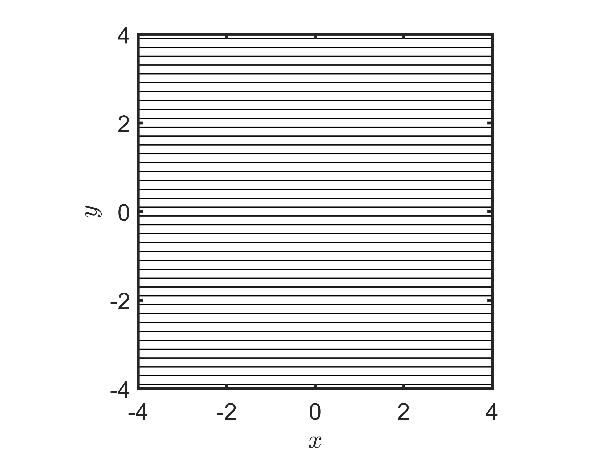
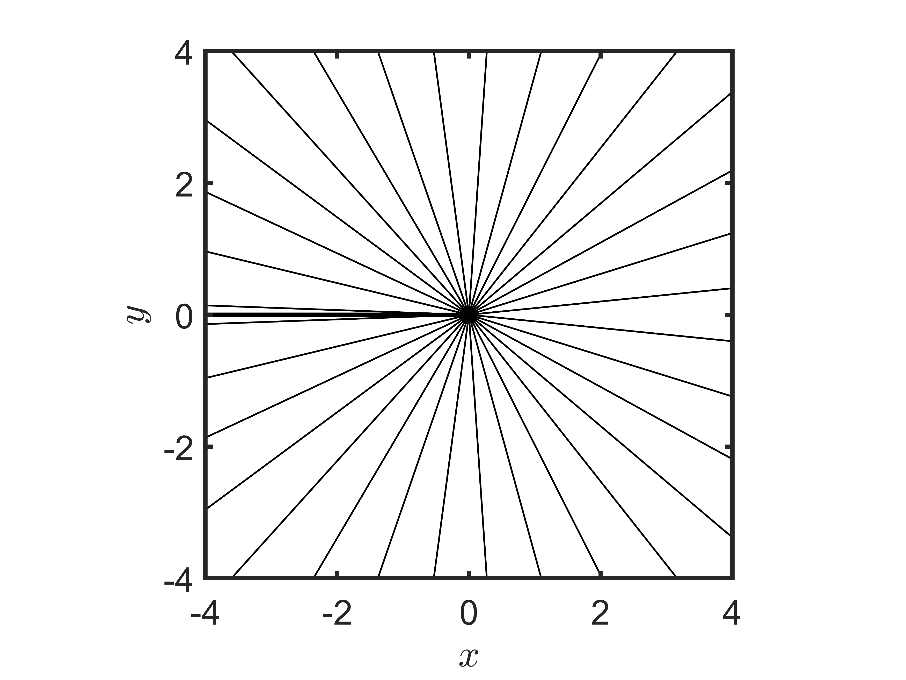
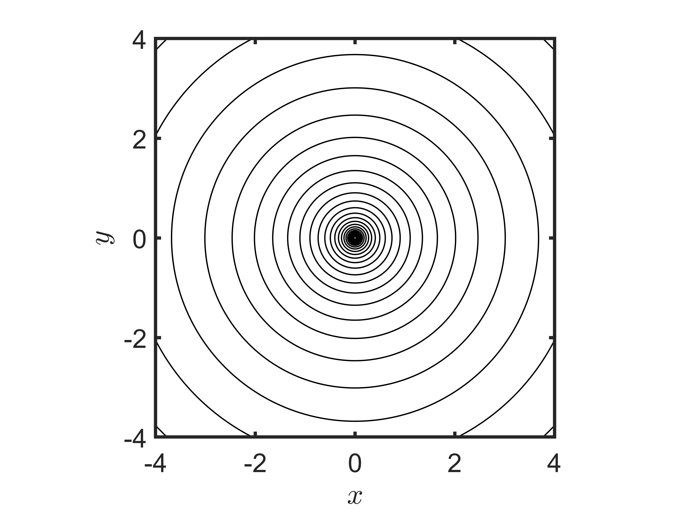
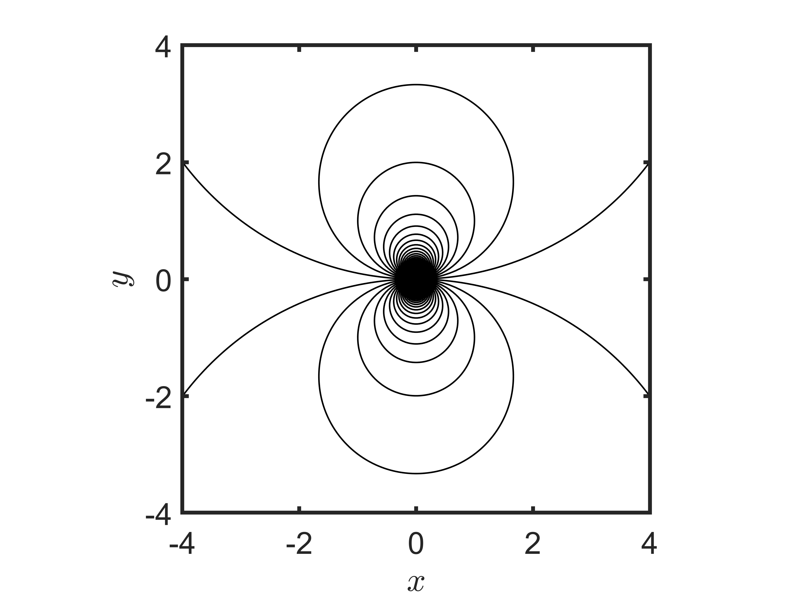
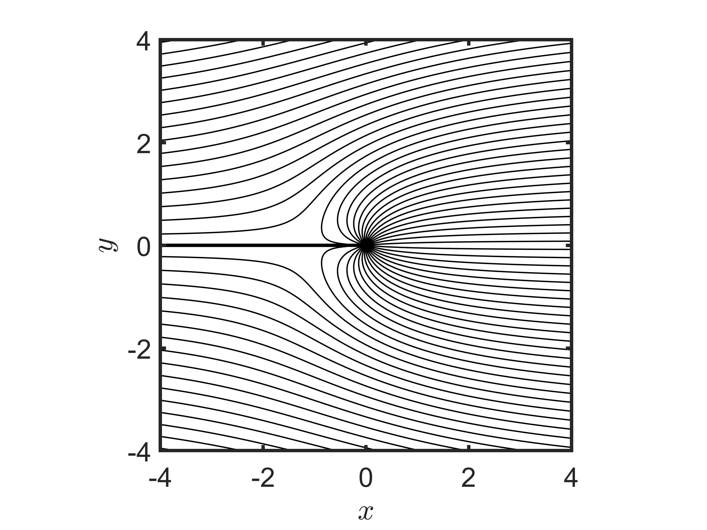
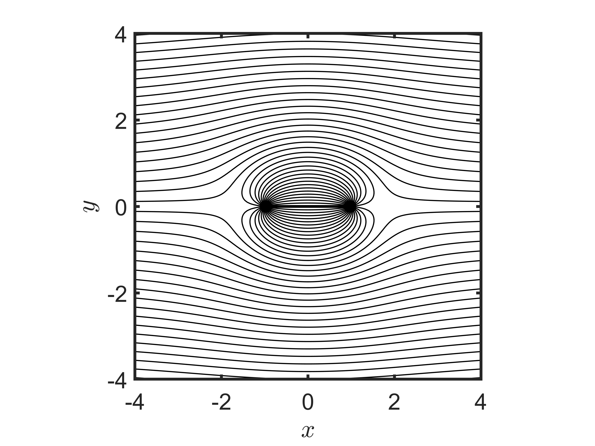
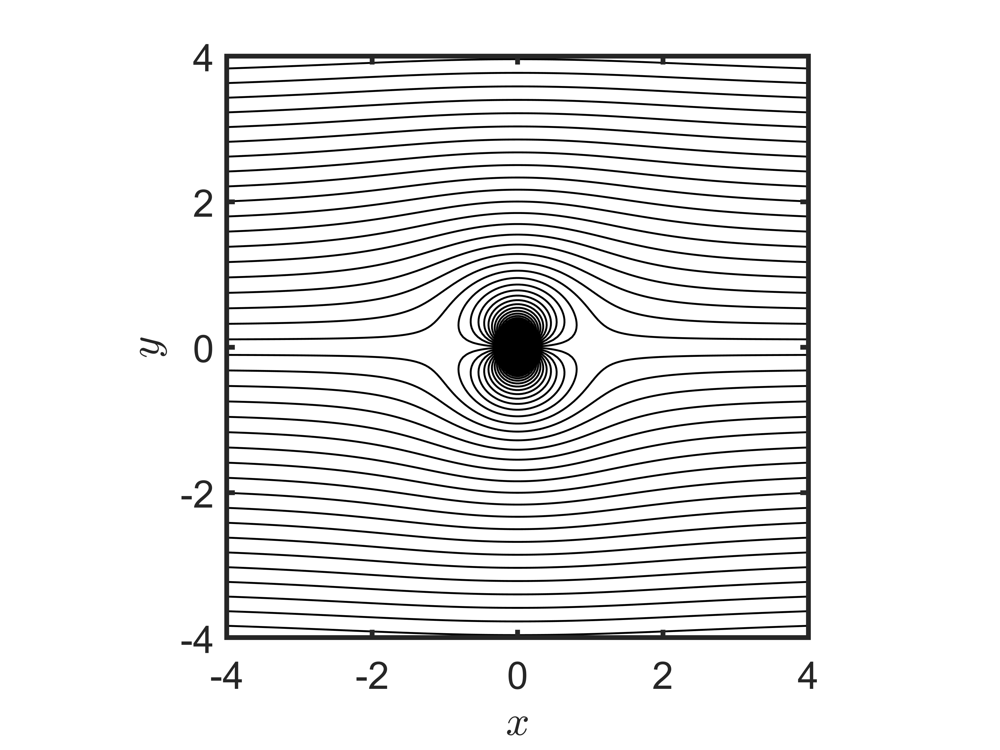
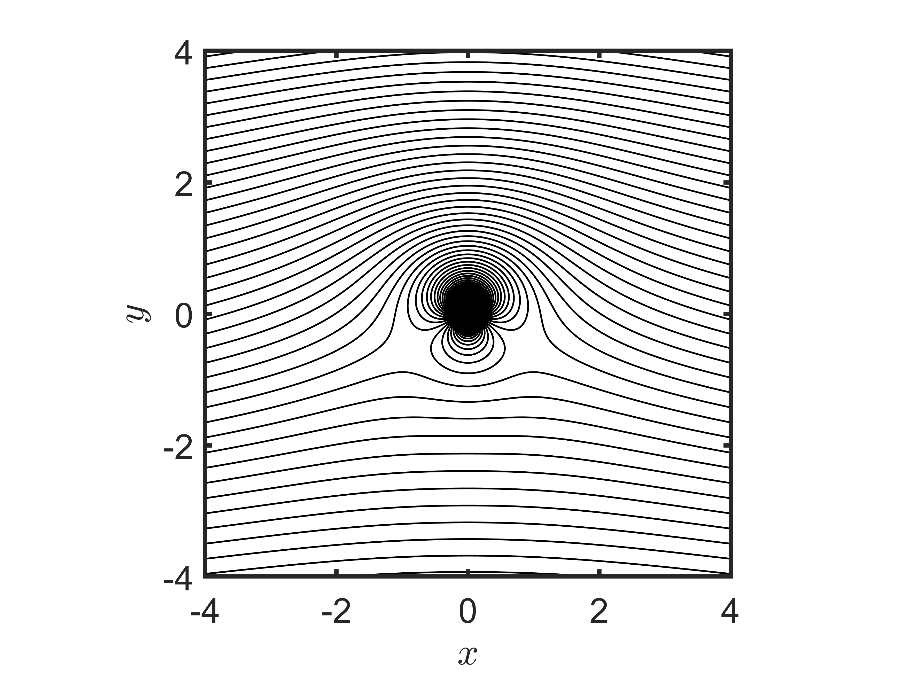

### Two-dimensional potential flow

Author: Yuchen Ge

Date: October 6, 2022

#### 1. Elementary flows

uniform flow in $x$ direction

$$
\psi=V_{\infty} y = V_{\infty} r \sin \theta
$$

source/sink flow ($\Lambda=2 \pi$)

$$
\psi=\frac{\Lambda}{2 \pi} \theta
$$

vortex flow ($\Gamma=2 \pi$)

$$
\psi=\frac{\Gamma}{2 \pi} \ln r
$$

doublet flow ($\kappa = 2 \pi$)

$$
\psi = - \frac{\kappa}{2 \pi} \frac{\sin \theta}{r}
$$

uniform stream + source = flow over a semi-infinite body

$$
\psi=V_{\infty} r \sin \theta+\frac{\Lambda}{2 \pi} \theta
$$

#### 2. Combination of the elementary flows

uniform flow + source = flow over a semi-infinite body

$$
\psi=V_{\infty} r \sin \theta+\frac{\Lambda}{2 \pi} \theta
$$

uniform flow +  source (left) + sink (right) = flow over a Rankine oval

$$
\psi=V_{\infty} r \sin \theta+\frac{\Lambda}{2 \pi} \theta_1-\frac{\Lambda}{2 \pi} \theta_2
$$

uniform flow + doublet = nonlifting flow over a circular cylinder

$$
\psi=V_{\infty} r \sin \theta-\frac{\kappa}{2 \pi} \frac{\sin \theta}{r}
$$

uniform flow + doublet + vortex = nonlifting flow over a circular cylinder + vortex = lifting flow over a circular cylinder 

$$
\psi=V_{\infty} r \sin \theta -\frac{\kappa}{2 \pi} \frac{\sin \theta}{r} + \frac{\Gamma}{2 \pi} \ln r
$$

#### Reference

1. Anderson, J. D. (2009). Fundamentals of aerodynamics. *McGraw*.